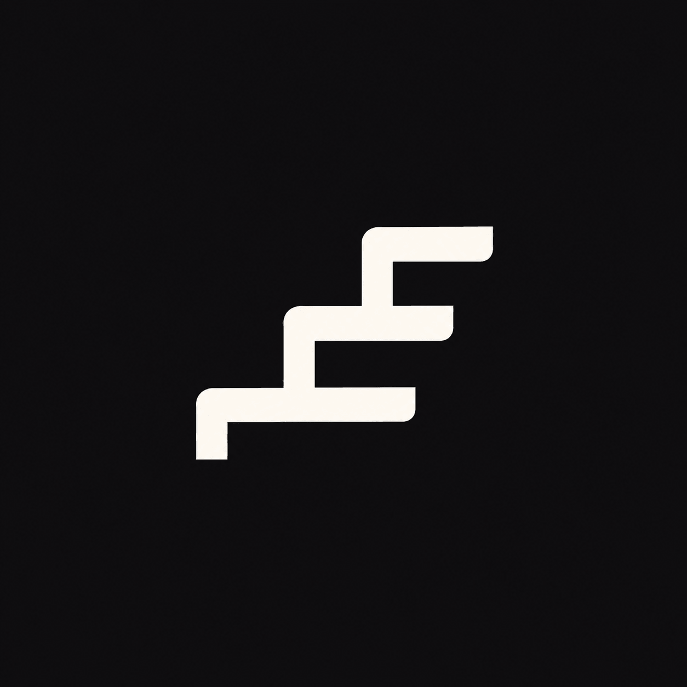

# rungs

  

A plugin marketplace for Claude Code, Codex, opencode and Copilot CLI.
It ships one plugin, `agents`: five subagents tiered by how much judgment a task needs, and a skill that routes work to them.
See [plugins/agents/README.md](plugins/agents/README.md).

## About Rungs

Rungs is built around a simple idea: **not every task needs the most capable agent**.

The logo represents that principle through three ascending rungs. Each level reflects a different degree of capability and judgment — from straightforward execution to more complex reasoning.

The shape sits between a ladder and a staircase: work moves upward only as complexity demands it.

This reflects how Rungs orchestrates coding agents: **choose the right rung for the task, rather than defaulting to the highest one.**

The mark is intentionally minimal, geometric, and architectural to match the tool itself: structured, predictable, and focused on efficient orchestration.
