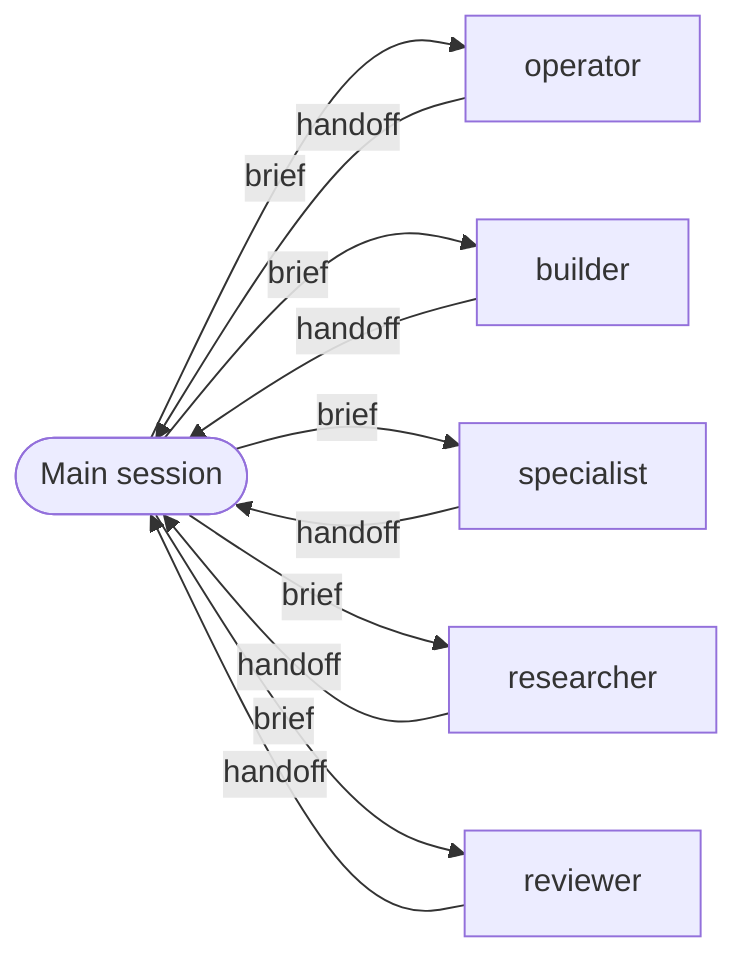

# agents

Five subagents tiered by how much judgment a task needs, not by job title. The main session decides, sequences, and talks to the user; subagents do the work and report back in one fixed handoff format. The `orchestrate` skill tells the main session whether to delegate and to whom. Claude Code is the primary target; Codex is supported through generated agent profiles.

## Rungs

| Agent | Use when | Claude pin | Codex pin |
|-------|----------|------------|-----------|
| `operator` | Exact files and edits are named, nothing is left to decide, and the work is bulk or mechanical | haiku | gpt-6-luna / low |
| `builder` | The task fits an existing pattern, touches a bounded set of files, and the open choices are local | sonnet / medium | gpt-6-sol / medium |
| `specialist` | No pattern exists, the change is cross-cutting, or a wrong call is expensive | opus / high | gpt-6.1-sol / high |

## Services

| Agent | Use when | Claude pin | Codex pin |
|-------|----------|------------|-----------|
| `researcher` | The caller needs facts before deciding (read-only) | sonnet / medium | gpt-6-sol / medium |
| `reviewer` | The caller is about to commit to a plan, diff, or decision with real blast radius (read-only) | opus / high | gpt-6.1-sol / high |

## How handoffs work



Only the main session starts agents. There are no edges between agents.
Every agent ends with the same handoff block: `STATUS`, `NEXT`, `SUMMARY`, `CHANGED`, `VERIFIED`, `STATE`, `OPEN`.
An agent that needs another one says so in `NEXT`; the main session decides whether to start it.
Any agent that changed files reports the verification command and its output, not a claim.
Questions that belong to the user come back as `STATUS: question` and are passed on unanswered.

The format and the rules live in one file: [skills/contract/SKILL.md](skills/contract/SKILL.md).

## Install

### Claude Code

```
/plugin marketplace add vicainelli/rungs
/plugin install agents@rungs
```

### Codex

```sh
codex plugin marketplace add vicainelli/rungs
```

Enable the plugin in the Codex app's plugin list, or in `~/.codex/config.toml`:

```toml
[plugins."agents@rungs"]
enabled = true
```

Codex plugins cannot ship agent profiles, so install those from a checkout of this repo:

```sh
sh plugins/agents/scripts/install-codex.sh
```

This copies five files into `${CODEX_HOME:-~/.codex}/agents/`. An existing file that differs is backed up to `<name>.toml.bak` first. To remove the profiles:

```sh
cd "${CODEX_HOME:-$HOME/.codex}/agents" && rm operator.toml researcher.toml builder.toml specialist.toml reviewer.toml
```

## Codex routing

Claude Code gets the delegation rule from the plugin's `SessionStart` hook. On Codex, paste this into `~/.codex/AGENTS.md`:

```markdown
## Delegation
The session orchestrates: it decides, sequences and talks to the user; subagents do the work.
Before any search, change, research, review, or external write, load the `orchestrate` skill;
it decides whether and to whom to delegate.
```

## Development

1. Edit `agents/*.md` or `skills/contract/SKILL.md`.
2. Run `python3 scripts/build-codex.py`. Codex model pins live in `PINS` at the top of that script.
3. Commit the sources and the regenerated `codex/*.toml` together. Never edit the TOML files by hand.

## Limits

- Read-only agents have no MCP access: their `tools` allowlist excludes everything not listed. Add specific read-only MCP tools to `tools:` if you need them.
- Claude model aliases (`haiku`, `sonnet`, `opus`) resolve to whatever Claude Code currently maps them to.
- Claude Code lets subagents start subagents by default. These agents cannot, because `Agent` is not in any `tools` list; adding it breaks the design.
- On Codex, read-only is the `read-only` sandbox mode, not a tool allowlist.- The Codex profiles are generated and parsed but have not been run: no Codex CLI was available when this was built. Whether Codex subagents can start further subagents is not documented and was not tested.
